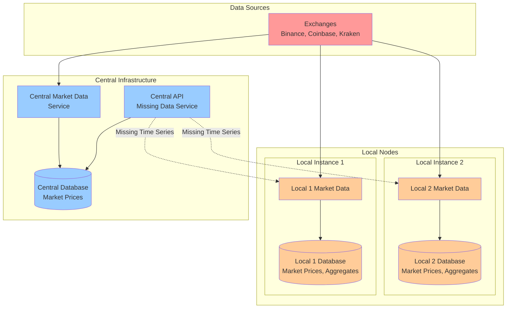

# AlphaLoop Core

A comprehensive trading system built with Clean Architecture principles and modern Python development practices.

## 🚀 Features

- **Clean Architecture**: Domain-driven design with clear separation of concerns
- **Modern Python Stack**: Python 3.12+, Poetry, FastAPI, SQLAlchemy, Pydantic
- **Type Safety**: Full MyPy integration with smart filtering
- **Code Quality**: Ruff for linting and formatting, pre-commit hooks
- **Testing**: Comprehensive unit, integration, and e2e tests with pytest
- **Docker Services**: Modular service architecture with local/cloud deployment variants
- **Development Tools**: Makefile workflows, GitHub PR analysis tools
- **Configuration**: Centralized environment management with configurable defaults
- **Currency Support**: Configurable default currency (USDT) for market data and trading
- **Reusable Packages**: Modular packages for heartbeat, logging, database, and data processing
- **Exchange Integrations**: Support for multiple cryptocurrency exchanges
- **Real-time Processing**: Async processing with message queues
- **Monitoring**: Health checks, logging, and alerting systems

## 📋 Prerequisites

- Python 3.12 or higher
- Poetry (for dependency management)
- Docker and Docker Compose (for containerized services)
- Git

## 🛠️ Quick Start

### Option 1: Using Poetry (Recommended)

#### 1. Install Dependencies

```bash
# Install Poetry if you haven't already
curl -sSL https://install.python-poetry.org | python3 -

# Install project dependencies
make install
```

### Option 2: Using Conda

#### 1. Install Conda

Download and install [Miniconda](https://docs.conda.io/en/latest/miniconda.html) or [Anaconda](https://www.anaconda.com/products/distribution).

#### 2. Create Environment

**On macOS/Linux:**
```bash
./scripts/setup_conda.sh
```

**On Windows:**
```cmd
scripts\setup_conda.bat
```

**Manual setup:**
```bash
# Create environment from yml file
conda env create -f environment.yml

# Activate environment
conda activate alphaloop-core

# Install project in development mode
poetry install

# Install pre-commit hooks
pre-commit install
```

#### 2. Set Up Development Environment

```bash
# Run the full development setup
make dev
```

This will:
- Install all dependencies
- Set up pre-commit hooks
- Format and lint the code
- Run type checking
- Execute unit tests

#### 3. Start Services

##### Option A: Using Docker Services (Recommended)

```bash
# Start local development services (with cloud sync)
make services-start-local

# Or start cloud production services
make services-start-cloud

# Check service status
make services-status

# View service logs
make services-logs
```

##### Option B: Using Legacy Commands (Deprecated)

```bash
# ⚠️  Legacy docker-compose.yml has been removed
# Use the new services structure instead:
make services-start-local    # For local development
make services-start-cloud    # For cloud deployment
```

#### 4. Run the API Locally

```bash
# Run the API with hot reload
make run-api
```

The API will be available at:
- **Local Development**: `http://localhost:8001`
- **Cloud Production**: `http://localhost:8000`

## 📁 Project Structure

```
alphaloop-core/
├── src/alphaloop_core/           # Core business logic
│   ├── domain/                   # Business entities & rules
│   │   ├── entities/            # Core business objects
│   │   ├── value_objects/       # Immutable value objects
│   │   ├── services/            # Business logic services
│   │   ├── repositories/        # Data access interfaces
│   │   └── events/              # Domain events
│   ├── application/              # Use cases & orchestration
│   │   ├── use_cases/           # Business use cases
│   │   ├── interfaces/          # CLI, API, gRPC interfaces
│   │   └── dependency_injection/ # Service container
│   ├── infrastructure/           # External concerns
│   │   ├── database/            # Database implementations
│   │   ├── external/            # Exchange & API integrations
│   │   ├── messaging/           # Message brokers
│   │   └── storage/             # Storage implementations
│   └── shared/                   # Common utilities
│       ├── utils/               # Shared utilities
│       ├── exceptions/          # Exception hierarchy
│       └── types/               # Custom types & enums
├── packages/                     # Reusable libraries
│   ├── alphaloop-heartbeat/     # Health monitoring
│   ├── alphaloop-security/      # Encryption & authentication
│   ├── alphaloop-logging/       # Advanced logging with Telegram
│   ├── alphaloop-database/      # Database abstractions
│   └── alphaloop-data/          # Data processing utilities
├── docker/                       # Docker configurations
├── tests/                        # Test suites
├── docs/                         # Documentation
└── scripts/                      # Build & deployment scripts
```

## 🔧 Development Workflows

### Code Quality

```bash
# Format code
make format

# Run linting
make lint

# Run type checking
make type-check

# Run all quality checks
make dev
```

### Testing

```bash
# Run unit tests
make test

# Run integration tests (requires running services)
make test-integration

# Run full integration test suite
make integration
```

### Service Management

```bash
# Start services
make start

# Stop services
make stop

# Restart services
make restart

# View logs
make logs

# Check service status
make status
```

## 🌐 API Endpoints

- `GET /` - Welcome message
- `GET /health` - Health check
- `GET /admin/health` - Detailed health check
- `GET /api/v1/status` - API status

## 🐳 Docker

The project includes complete Docker support:

```bash
# Build and start all services
docker compose up -d

# View logs
docker compose logs -f

# Stop services
docker compose down
```

### Services

- **API**: FastAPI application on port 8000
- **Database**: PostgreSQL 15 on port 5432

## 🔐 Configuration

Copy the environment template and customize:

```bash
cp env.example .env
```

Key configuration options:

- `SERVICE_HOST` / `SERVICE_PORT`: API service location
- `DB_HOST` / `DB_PORT`: Database connection
- `API_KEY`: Authentication key
- `LOG_LEVEL`: Logging verbosity
- `ENVIRONMENT`: Deployment environment
- `DEFAULT_CURRENCY`: Default currency for market data and trading operations (default: USDT)

### Currency Configuration

The system supports configurable default currency for all market data and trading operations:

```bash
# Set default currency in environment
export DEFAULT_CURRENCY=USDT  # Default value
export DEFAULT_CURRENCY=BTC   # Alternative option
export DEFAULT_CURRENCY=ETH   # Another option
```

Supported currencies: `USD`, `EUR`, `BTC`, `ETH`, `USDT`, `USDC`

The default currency is used when creating `MarketData` entities unless explicitly specified. This ensures consistent currency handling throughout the system while allowing flexibility when needed.

## 🏗️ Services Architecture

The project uses a modular Docker service architecture:

### 🗄️ Database Service (`alphaloop-database`)
- **PostgreSQL 16.4** with separate databases for system and market data
- **Health checks** and persistent storage
- **User management** with separate permissions

### 📊 System Metrics Service (`alphaloop-system-metrics`)
- **System monitoring** (CPU, memory, disk usage)
- **Hardware information** collection
- **Performance metrics** aggregation

### 📈 Market Data Service (`alphaloop-market-data`)
- **Local deployment**: Includes central infrastructure data synchronization for missing data
- **Central deployment**: Primary data collection only
- **Real-time processing** with configurable intervals

For detailed service documentation, see [Services README](services/README.md).

## 🏗️ System Overview



For comprehensive architecture diagrams, see [System Architecture Diagrams](docs/architecture/diagrams/system-overview.md).

## 🧪 Testing

### Unit Tests

```bash
# Run all unit tests
make test

# Run specific test file
poetry run pytest tests/unit/test_config.py -v
```

### Integration Tests

```bash
# Start services and run integration tests
make integration
```

### Test Coverage

```bash
# Run tests with coverage
poetry run pytest --cov=alphaloop_core tests/
```

## 📊 GitHub PR Tools

The project includes tools for analyzing GitHub PR comments:

```bash
# Export PR comments
./scripts/github-pr-tools/export_github_pr_comments.sh 123

# Analyze comments and generate LLM prompt
python scripts/github-pr-tools/analyze_pr_comments.py output/pr_123_comments.json
```

## 🚀 CLI Usage

```bash
# Show CLI help
poetry run alphaloop-cli --help

# Show service status
poetry run alphaloop-cli status

# Show detailed status
poetry run alphaloop-cli status --detailed

# Show configuration
poetry run alphaloop-cli config

# Show specific config key
poetry run alphaloop-cli config --key API_KEY
```

## 🔍 Pre-commit Hooks

The project uses pre-commit hooks for code quality:

- **Trailing whitespace removal**
- **End-of-file fixer**
- **YAML validation**
- **Large file detection**
- **Merge conflict detection**
- **Ruff linting and formatting**
- **MyPy type checking**

## 📚 Documentation

### Core Documents
- [**Architecture Overview**](docs/architecture/overview.md) - System architecture and design decisions
- [**System Architecture Diagrams**](docs/architecture/diagrams/system-overview.md) - Visual system architecture and data flows
- [**Coding Standards & Axioms**](docs/development/coding-standards.md) - Core principles and axioms
- [**Axioms Reference Card**](docs/development/axioms-reference.md) - Quick reference for daily development
- [**Architecture Decision Records**](docs/architecture/decisions/) - ADRs for architectural decisions

### Development Guides
- [API Documentation](docs/api/) - API endpoints and usage examples
- [Development Guide](docs/development/) - Development setup and guidelines

## 📝 Contributing

1. Fork the repository
2. Create a feature branch
3. Make your changes
4. **Review against our [Coding Standards & Axioms](docs/development/coding-standards.md)**
5. Run the development cycle: `make dev`
6. Commit your changes (pre-commit hooks will run automatically)
7. Push to your branch and create a pull request

## 📄 License

This project is licensed under the MIT License - see the LICENSE file for details.

## 🤝 Support

For support and questions:

1. Check the documentation
2. Search existing issues
3. Create a new issue with detailed information

---

**Built with ❤️ using modern Python development practices**
