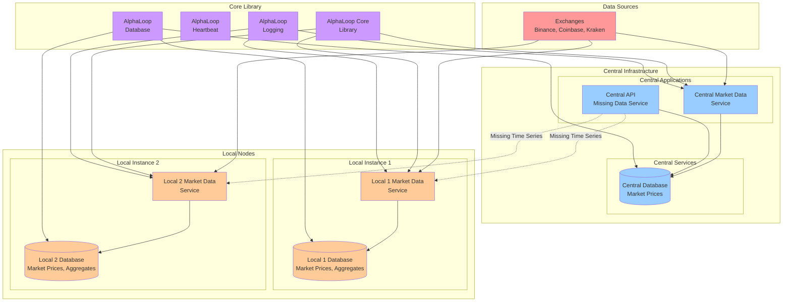
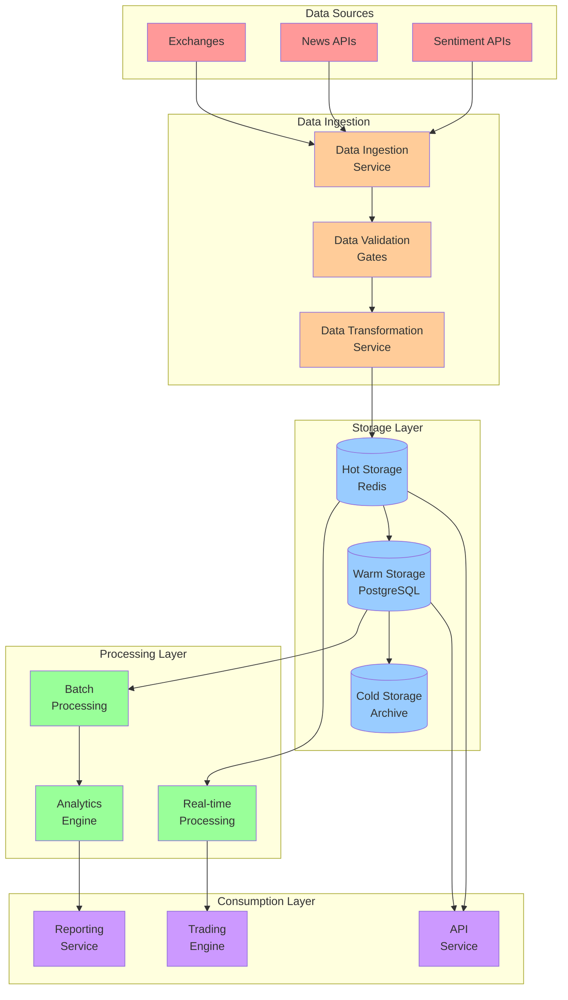
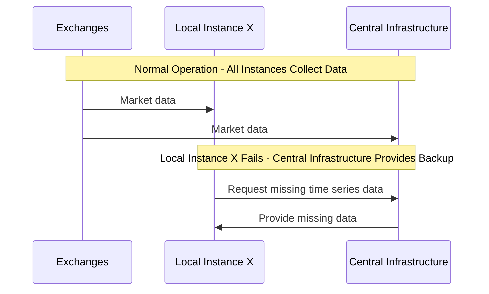
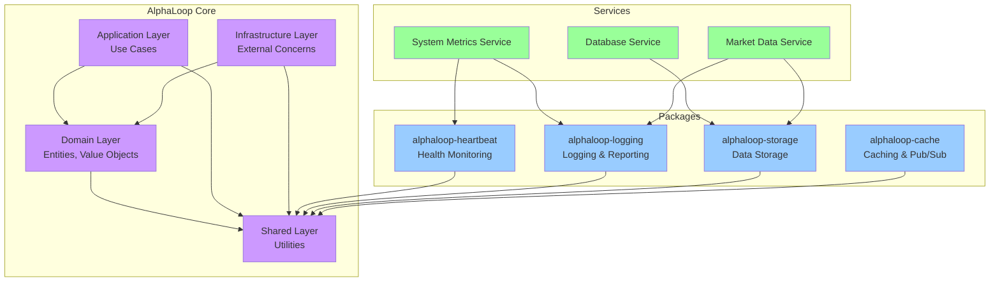
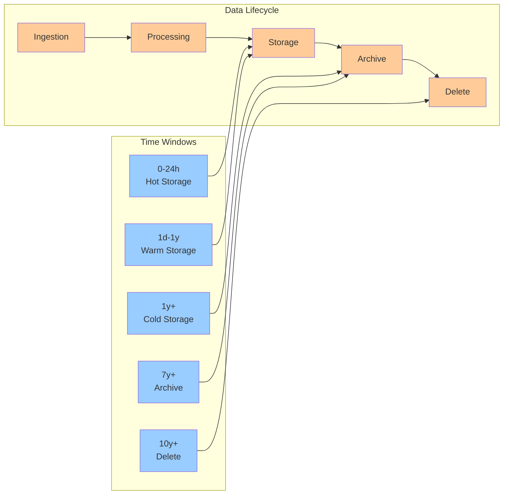
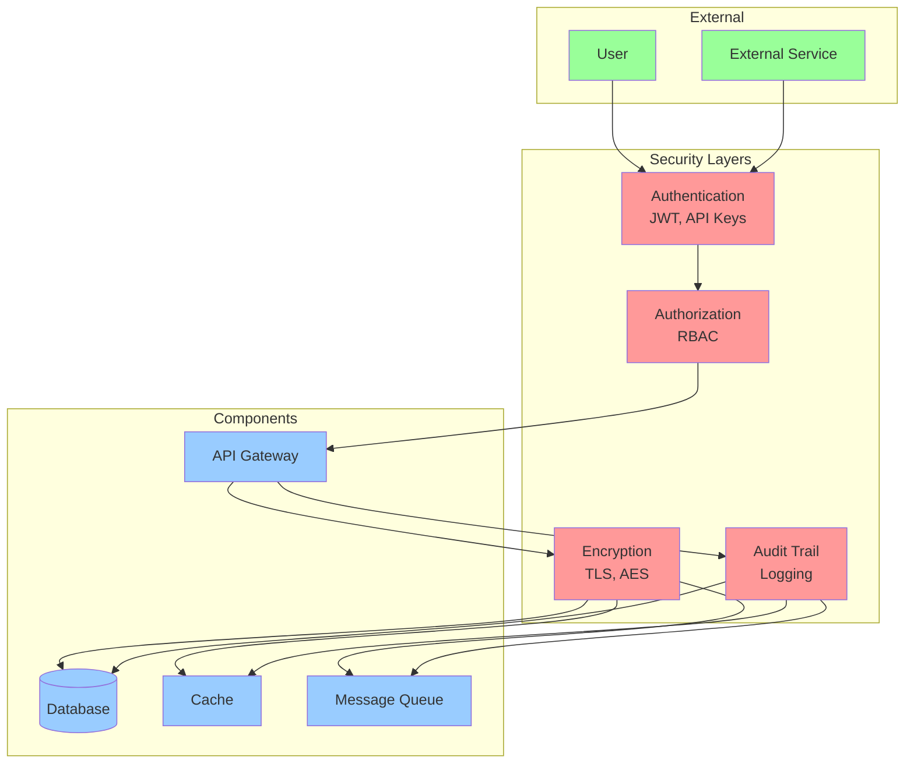

# System Architecture Diagrams

## Overview

This document contains Mermaid diagrams that visualize the AlphaLoop system architecture, data flows, and component relationships.

## System Overview

## Data Flow Architecture

## Service Communication

## Other Architecture Diagrams

The following diagrams are conceptual and may not reflect the current implementation:

### Data Flow Architecture
Shows a generic data processing pipeline from ingestion to consumption. This is a conceptual view of how data could flow through the system.

### Library Architecture
Shows how the AlphaLoop Core library and packages could be organized. The AlphaLoop Core library provides the foundation for all services.

**AlphaLoop Core Library**: This is the main library that contains the core business logic, domain entities, use cases, and infrastructure code. It's the foundation that all services (cloud and edge devices) use to implement their functionality.

### Data Lifecycle
Shows how data moves through different storage tiers over time. This is a conceptual view of data retention and archival policies.

### Security Architecture
Shows a generic security model with authentication, authorization, encryption, and audit layers. This is a conceptual security framework.

## Library Architecture

## Data Lifecycle

## Security Architecture

