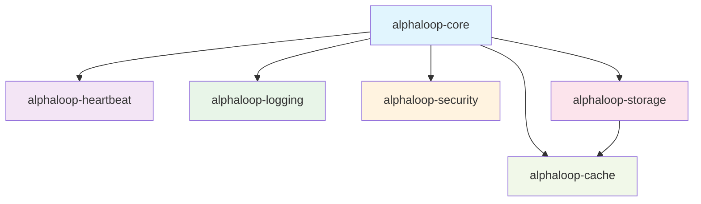

# AlphaLoop Infrastructure Packages

This directory contains the **infrastructure packages** that provide essential services for the AlphaLoop system. These packages are designed to be **reusable, independent, and uncoupled** from business logic.

## 📦 Package Overview

| Package | Purpose | Key Features |
|---------|---------|--------------|
| **alphaloop-heartbeat** | Health monitoring | Service health checks, heartbeat generation, process monitoring |
| **alphaloop-logging** | Centralized logging | Multi-handler logging, Telegram integration, structured output |
| **alphaloop-security** | Security & encryption | Time-based authentication, data encryption, secure URLs |
| **alphaloop-storage** | Database management | Connection pooling, schema management, table operations |
| **alphaloop-cache** | Caching & messaging | Redis/Valkey integration, price caching, pub/sub |

## 🔗 Package Dependencies



### **Dependency Flow**
- **alphaloop-core** depends on all infrastructure packages
- **alphaloop-storage** may use **alphaloop-cache** for caching
- **No circular dependencies** between infrastructure packages
- **Independent development** - each package can be updated separately

## 🚀 Quick Start

### **Install All Infrastructure Packages**

```bash
# From project root
poetry install

# Or install individual packages
cd infrastructure/alphaloop-heartbeat && poetry install
cd infrastructure/alphaloop-logging && poetry install
cd infrastructure/alphaloop-security && poetry install
cd infrastructure/alphaloop-storage && poetry install
cd infrastructure/alphaloop-cache && poetry install
```

### **Using Infrastructure Packages in Core**

```python
from alphaloop_core import service_factory

# Get services from infrastructure packages
logger = await service_factory.get_logger()
cache_manager = await service_factory.get_cache_manager()
database_manager = await service_factory.get_database_manager()
authenticator = service_factory.get_authenticator()
```

## 🏗️ Development Workflow

### **Working with Infrastructure Packages**

#### **1. Individual Package Development**
```bash
# Work on a specific package
cd infrastructure/alphaloop-heartbeat
poetry install
poetry run pytest
poetry run mypy src/
```

#### **2. Cross-Package Testing**
```bash
# Test all infrastructure packages
make test-infrastructure

# Test specific package integration
make test-package-integration
```

#### **3. Documentation Updates**
```bash
# Update package documentation
cd infrastructure/alphaloop-[package-name]
# Edit README.md and docstrings
```

### **Package Development Standards**

#### **✅ Required for Each Package**
- **Comprehensive README.md** with usage examples
- **Full test coverage** (unit + integration tests)
- **Type hints** throughout the codebase
- **Docstrings** for all classes and methods
- **Mermaid diagrams** for complex workflows
- **Configuration management** via environment variables

#### **✅ Architecture Principles**
- **No business logic** - pure infrastructure concerns
- **Reusable** across different projects
- **Uncoupled** from alphaloop-core business logic
- **Configurable** via environment variables
- **Async-first** design where appropriate

## 🔧 Configuration Management

### **Environment Variables**

Each package uses environment variables for configuration:

```bash
# alphaloop-heartbeat
HEARTBEAT_INTERVAL=30
HEARTBEAT_TIMEOUT=120
HEARTBEAT_DIRECTORY=/var/heartbeats

# alphaloop-logging
LOG_LEVEL=INFO
LOG_FORMAT=json
TELEGRAM_BOT_TOKEN=your_token
TELEGRAM_CHAT_ID=your_chat_id

# alphaloop-security
SECURITY_SECRET_KEY=your_secret_key
SECURITY_TIME_WINDOW=300

# alphaloop-storage
DB_HOST=localhost
DB_PORT=5432
DB_NAME=alphaloop
DB_USER=postgres
DB_PASSWORD=password

# alphaloop-cache
CACHE_HOST=localhost
CACHE_PORT=6379
CACHE_DB=0
CACHE_PASSWORD=
```

### **Configuration Loading**

```python
# Each package provides configuration classes
from alphaloop_heartbeat.config.settings import HeartbeatSettings
from alphaloop_logging.config.settings import LoggingConfig
from alphaloop_security.config.settings import SecurityConfig
from alphaloop_storage.config.settings import DatabaseConfig
from alphaloop_cache.config.settings import CacheConfig

# Load from environment
settings = HeartbeatSettings.from_env()
```

## 🧪 Testing Strategy

### **Individual Package Tests**
```bash
# Run tests for specific package
cd infrastructure/alphaloop-heartbeat
poetry run pytest

# Run with coverage
poetry run pytest --cov=src/alphaloop_heartbeat
```

### **Integration Tests**
```bash
# Test package integration with core
make test-integration

# Test specific integrations
make test-storage-cache-integration
make test-logging-security-integration
```

### **End-to-End Tests**
```bash
# Test complete infrastructure layer
make test-infrastructure-e2e
```

## 📊 Package Metrics

### **Code Quality**
- **Test Coverage**: >90% for all packages
- **Type Coverage**: 100% with MyPy
- **Documentation**: Comprehensive READMEs and docstrings
- **Linting**: Ruff compliance across all packages

### **Performance**
- **Async Support**: All packages support async operations
- **Connection Pooling**: Efficient resource management
- **Caching**: Built-in caching where appropriate
- **Error Handling**: Comprehensive error management

## 🔄 Version Management

### **Package Versions**
Each package maintains its own version in `pyproject.toml`:

```toml
[tool.poetry]
name = "alphaloop-heartbeat"
version = "0.1.0"
```

### **Dependency Updates**
```bash
# Update all infrastructure packages
make update-infrastructure-packages

# Update specific package
cd infrastructure/alphaloop-[package-name]
poetry update
```

## 🚨 Troubleshooting

### **Common Issues**

#### **Import Errors**
```bash
# Ensure packages are installed
poetry install

# Check Python path
python -c "import alphaloop_heartbeat"
```

#### **Configuration Issues**
```bash
# Check environment variables
env | grep -E "(HEARTBEAT|LOG|SECURITY|DB|CACHE)"

# Validate configuration
python -c "from alphaloop_heartbeat.config.settings import HeartbeatSettings; print(HeartbeatSettings.from_env())"
```

#### **Service Connection Issues**
```bash
# Check service status
make status

# View service logs
make logs
```

## 📚 Additional Resources

### **Package Documentation**
- [alphaloop-heartbeat](./alphaloop-heartbeat/README.md) - Health monitoring
- [alphaloop-logging](./alphaloop-logging/README.md) - Logging system
- [alphaloop-security](./alphaloop-security/README.md) - Security utilities
- [alphaloop-storage](./alphaloop-storage/README.md) - Database management
- [alphaloop-cache](./alphaloop-cache/README.md) - Caching system

### **Architecture Documentation**
- [Package Integration](../docs/architecture/package-integration.md) - How packages integrate with core
- [System Overview](../docs/architecture/diagrams/system-overview.md) - Overall system architecture
- [Development Guidelines](../docs/development/coding_standards.md) - Development standards

### **Examples**
- [Using Official Packages](../examples/using_official_packages.py) - How to use infrastructure packages
- [Logging Demo](../examples/logging_demo.py) - Logging package usage
- [Security Demo](../examples/security_demo.py) - Security package usage

---

**🎯 Goal**: These infrastructure packages provide a solid foundation for building robust, scalable, and maintainable systems while maintaining clean separation of concerns and reusability across different projects.
