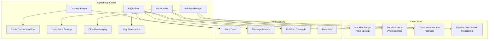

# AlphaLoop Cache Package

A Redis/Valkey caching and pub/sub functionality package for AlphaLoop systems, providing local price caching and cloud messaging capabilities.

## 🗄️ Overview

The AlphaLoop Cache package provides comprehensive caching and messaging solutions for distributed AlphaLoop infrastructure:

- **Local Price Caching** - Fast access to recent price data for MockExchange
- **Cloud Pub/Sub** - Distributed messaging for system coordination
- **Redis/Valkey Integration** - Modern async Redis client with connection pooling
- **Key Management** - Structured key building and validation
- **Data Serialization** - Automatic JSON serialization/deserialization

## 🏗️ Architecture



## 🚀 Features

### **Cache Management**
- ✅ **Async Redis Client** - Modern aioredis with connection pooling
- ✅ **Configuration Management** - Environment-based configuration
- ✅ **Connection Health** - Connection testing and monitoring
- ✅ **Memory Management** - Memory usage tracking and optimization
- ✅ **TTL Support** - Automatic expiration and cleanup

### **Price Caching**
- ✅ **Local Price Storage** - Fast access to recent price data
- ✅ **Multi-Exchange Support** - Cache prices from multiple exchanges
- ✅ **MockExchange Integration** - Seamless integration with paper trading
- ✅ **Price History** - Historical price data with time-based queries
- ✅ **Cache Invalidation** - Smart cache invalidation strategies

### **Pub/Sub Messaging**
- ✅ **Distributed Messaging** - Cloud-based message distribution
- ✅ **Channel Management** - Multiple channel support with handlers
- ✅ **Message Persistence** - Message history and replay capabilities
- ✅ **Async Handlers** - Non-blocking message processing
- ✅ **Message Metadata** - Rich message metadata and tracking

### **Key Management**
- ✅ **Structured Keys** - Consistent key naming conventions
- ✅ **Key Validation** - Input validation and sanitization
- ✅ **Pattern Matching** - Efficient key pattern scanning
- ✅ **Namespace Support** - Organized key namespacing
- ✅ **Key Parsing** - Key component extraction and analysis

## 📦 Installation

```bash
# From the packages directory
cd packages/alphaloop-cache
poetry install
```

## 🔧 Quick Start

### Basic Cache Connection

```python
import asyncio
from alphaloop_cache import CacheConfig, CacheManager

async def main():
    # Create cache configuration
    config = CacheConfig(
        host="localhost",
        port=6379,
        db=0,
        password="",
    )

    # Create cache manager
    cache_manager = CacheManager(config)

    # Test connection
    is_connected = await cache_manager.test_connection()
    print(f"Cache connected: {is_connected}")

    # Get cache info
    info = await cache_manager.get_info()
    print(f"Cache info: {info}")

if __name__ == "__main__":
    asyncio.run(main())
```

### Price Caching

```python
from alphaloop_cache import PriceCache, PriceData, CacheManager
from datetime import datetime

async def main():
    # Create cache manager
    cache_manager = CacheManager(config)

    # Create price cache
    price_cache = PriceCache(cache_manager, default_ttl=300)

    # Create price data
    price_data = PriceData(
        symbol="BTC/USDT",
        price=50000.0,
        timestamp=datetime.utcnow(),
        exchange="binance",
        volume=1000.0,
        bid=49999.0,
        ask=50001.0,
    )

    # Cache price
    success = await price_cache.cache_price(price_data)
    print(f"Price cached: {success}")

    # Retrieve price
    cached_price = await price_cache.get_price("BTC/USDT", "binance")
    if cached_price:
        print(f"Cached price: {cached_price.price}")

    # Get MockExchange data
    mock_data = await price_cache.get_mock_exchange_data("BTC/USDT")
    print(f"Mock data: {mock_data}")

```

### Pub/Sub Messaging

```python
from alphaloop_cache import PubSubManager, CacheManager

async def message_handler(message):
    """Handle incoming messages."""
    print(f"Received message on {message.channel}: {message.message}")

async def main():
    # Create cache manager
    cache_manager = CacheManager(config)

    # Create pub/sub manager
    pubsub_manager = PubSubManager(cache_manager)

    # Subscribe to channel
    handler_id = await pubsub_manager.subscribe("market_data", message_handler)
    print(f"Subscribed with ID: {handler_id}")

    # Publish message
    await pubsub_manager.publish(
        channel="market_data",
        message={
            "type": "price_update",
            "symbol": "BTC/USDT",
            "price": 50000.0,
        },
        sender="local_instance",
    )

    # Start listening
    await pubsub_manager.start_listening()

```

### Key Building

```python
from alphaloop_cache import KeyBuilder

# Create key builder
key_builder = KeyBuilder(prefix="alphaloop")

# Build different types of keys
price_key = key_builder.build_price_key("BTC/USDT", "binance")
message_key = key_builder.build_message_key("market_data", datetime.utcnow())
user_key = key_builder.build_user_key("user123", "preferences")

print(f"Price key: {price_key}")
print(f"Message key: {message_key}")
print(f"User key: {user_key}")

# Validate keys
is_valid = key_builder.is_valid_key(price_key)
print(f"Key valid: {is_valid}")
```

## ⚙️ Configuration

### Environment Variables

```bash
# Cache Configuration
CACHE_HOST=localhost
CACHE_PORT=6379
CACHE_DB=0
CACHE_PASSWORD=
CACHE_SSL=false
CACHE_SSL_CERT_REQS=required
CACHE_MAX_CONNECTIONS=20
CACHE_RETRY_ON_TIMEOUT=true
CACHE_SOCKET_CONNECT_TIMEOUT=5
CACHE_SOCKET_TIMEOUT=5
CACHE_DECODE_RESPONSES=true
CACHE_ENCODING=utf-8
```

### Configuration from Environment

```python
from alphaloop_cache import CacheConfig

# Load from environment variables
config = CacheConfig.from_env(prefix="CACHE_")

# Or with custom prefix
config = CacheConfig.from_env(prefix="ALPHALOOP_CACHE_")
```

## 📊 Use Cases

### **Local Price Caching for MockExchange**

```python
# Cache recent prices for paper trading
price_cache = PriceCache(cache_manager)

# Cache price from exchange
await price_cache.cache_price(price_data)

# MockExchange can now use cached data
mock_data = await price_cache.get_mock_exchange_data("BTC/USDT")
if mock_data:
    # Use cached price for paper trading
    paper_price = mock_data["price"]
```

### **Cloud Pub/Sub for System Coordination**

```python
# Local instance publishes status
await pubsub_manager.publish(
    channel="system_status",
    message={
        "instance_id": "rpi-001",
        "status": "healthy",
        "timestamp": datetime.utcnow().isoformat(),
    }
)

# Cloud infrastructure subscribes
async def status_handler(message):
    instance_status = message.message
    # Update system status dashboard
    await update_dashboard(instance_status)

await pubsub_manager.subscribe("system_status", status_handler)
```

### **Multi-Exchange Price Aggregation**

```python
# Cache prices from multiple exchanges
exchanges = ["binance", "coinbase", "kraken"]
symbol = "BTC/USDT"

for exchange in exchanges:
    price_data = PriceData(
        symbol=symbol,
        price=get_price_from_exchange(exchange, symbol),
        timestamp=datetime.utcnow(),
        exchange=exchange,
    )
    await price_cache.cache_price(price_data)

# Get best price across exchanges
latest_prices = await price_cache.get_latest_prices([symbol], "binance")
```

## 🔄 Integration with Other Packages

### **With alphaloop-storage**

```python
# Cache frequently accessed data from storage
from alphaloop_storage import TableHandler
from alphaloop_cache import CacheManager

# Get data from storage
table_handler = TableHandler("market_data", db_manager)
data = await table_handler.get_all_data(output_type="pandas")

# Cache the data
cache_manager = CacheManager(config)
await cache_manager.set_key("market_data_cache", data.to_dict(), ttl=300)
```

### **With alphaloop-logging**

```python
# Log cache operations
from alphaloop_logging import AlphaLoopLogger
from alphaloop_cache import PriceCache

logger = AlphaLoopLogger()

async def cache_price_with_logging(price_data):
    try:
        success = await price_cache.cache_price(price_data)
        if success:
            await logger.info(f"Price cached: {price_data.symbol}")
        else:
            await logger.error(f"Failed to cache price: {price_data.symbol}")
    except Exception as e:
        await logger.error(f"Cache error: {e}")
```

## 🧪 Testing

```bash
# Run basic tests
python tests/test_basic.py

# Run with pytest
poetry run pytest

# Run with coverage
poetry run pytest --cov=alphaloop_cache
```

## 📈 Performance

- **Connection Pooling** - Efficient Redis connection reuse
- **Async Operations** - Non-blocking cache operations
- **Key Optimization** - Structured key patterns for fast lookups
- **Memory Management** - Automatic cleanup and TTL management
- **Batch Operations** - Efficient bulk operations

## 🔒 Security

- **Connection Security** - SSL/TLS support for Redis connections
- **Key Sanitization** - Input validation and sanitization
- **Access Control** - Redis authentication and authorization
- **Error Handling** - Secure error messages and logging
- **Data Validation** - Pydantic model validation

## 🚀 Deployment

### Production Checklist

- [ ] Configure Redis/Valkey server
- [ ] Set up SSL/TLS connections
- [ ] Configure connection pooling
- [ ] Set up monitoring and alerting
- [ ] Test failover scenarios
- [ ] Optimize memory usage
- [ ] Set up backup and recovery

### Best Practices

1. **Use Connection Pooling** - Configure appropriate pool sizes
2. **Implement Retry Logic** - Handle transient connection issues
3. **Monitor Memory Usage** - Track Redis memory consumption
4. **Use TTL Wisely** - Set appropriate expiration times
5. **Validate Input** - Sanitize all user inputs
6. **Backup Regularly** - Implement Redis backup strategies
7. **Test Pub/Sub** - Verify message delivery and handling

## 📚 API Reference

### CacheManager

**Methods:**
- `async test_connection()`: Test cache connectivity
- `async get_info()`: Get cache server information
- `async set_key(key, value, ttl)`: Set key with optional TTL
- `async get_key(key)`: Get value for key
- `async delete_key(key)`: Delete key

### PriceCache

**Methods:**
- `async cache_price(price_data, ttl)`: Cache price data
- `async get_price(symbol, exchange)`: Get cached price
- `async get_latest_prices(symbols, exchange)`: Get multiple prices
- `async get_mock_exchange_data(symbol)`: Get data for MockExchange
- `async cleanup_expired()`: Clean up expired entries

### PubSubManager

**Methods:**
- `async publish(channel, message)`: Publish message to channel
- `async subscribe(channel, handler)`: Subscribe to channel
- `async unsubscribe(channel, handler_id)`: Unsubscribe from channel
- `async start_listening()`: Start message listening
- `async stop_listening()`: Stop message listening

### KeyBuilder

**Methods:**
- `build_price_key(symbol, exchange)`: Build price cache key
- `build_message_key(channel, timestamp)`: Build message key
- `is_valid_key(key)`: Validate key format
- `sanitize_key(key)`: Sanitize key for storage
- `parse_key(key)`: Parse key into components

## 🤝 Contributing

1. Fork the repository
2. Create a feature branch
3. Make your changes
4. Add tests
5. Run the test suite
6. Submit a pull request

## 📄 License

This package is part of the AlphaLoop Core project.
