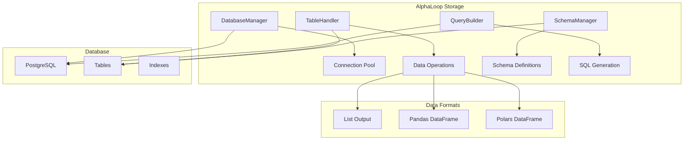

# AlphaLoop Storage Package

A unified data storage and management layer for AlphaLoop systems, providing modern database operations, schema management, and data lifecycle capabilities.

## 🗄️ Overview

The AlphaLoop Storage package provides a comprehensive solution for managing persistent data across your AlphaLoop infrastructure. It modernizes the legacy `dbHandler` and `dbTables` functionality with:

- **Async Database Operations** - Modern SQLAlchemy 2.0 with async support
- **Schema Management** - YAML-based schema definitions and validation
- **Multi-Format Support** - List, Pandas, and Polars output formats
- **Query Building** - Fluent API for constructing complex queries
- **Data Lifecycle** - Aggregation, retention, and backup policies

## 🏗️ Architecture



## 🚀 Features

### **Database Management**
- ✅ **Async/Sync Support** - Both async and synchronous operations
- ✅ **Connection Pooling** - Efficient connection management
- ✅ **Transaction Safety** - Proper session and transaction handling
- ✅ **Configuration Management** - Environment-based configuration
- ✅ **Health Monitoring** - Database connection and performance monitoring

### **Schema Management**
- ✅ **YAML Schemas** - Declarative schema definitions
- ✅ **Schema Validation** - Automatic schema validation and migration
- ✅ **DDL Generation** - Automatic SQL DDL generation
- ✅ **Table Hierarchy** - Parent-child table relationships
- ✅ **Dependency Tracking** - Table dependency management

### **Data Operations**
- ✅ **CRUD Operations** - Create, Read, Update, Delete
- ✅ **Multi-Format Output** - List, Pandas, Polars
- ✅ **Query Building** - Fluent query construction API
- ✅ **Batch Operations** - Efficient bulk data operations
- ✅ **Data Validation** - Input validation and sanitization

### **Advanced Features**
- ✅ **Data Lifecycle** - Aggregation, retention, cleanup policies
- ✅ **Performance Optimization** - Query optimization and indexing
- ✅ **Error Handling** - Comprehensive error handling and recovery
- ✅ **Logging Integration** - Structured logging for operations
- ✅ **Type Safety** - Full type hints and validation

## 📦 Installation

```bash
# From the infrastructure directory
cd infrastructure/alphaloop-storage
poetry install
```

## 🔧 Quick Start

### Basic Database Connection

```python
import asyncio
from alphaloop_storage import DatabaseConfig, DatabaseManager

async def main():
    # Create database configuration
    config = DatabaseConfig(
        host="localhost",
        database="alphaloop",
        username="postgres",
        password="password"
    )

    # Create database manager
    db_manager = DatabaseManager(config)

    # Test connection
    is_connected = await db_manager.test_connection()
    print(f"Database connected: {is_connected}")

    # Get database info
    info = await db_manager.get_database_info()
    print(f"Database info: {info}")

if __name__ == "__main__":
    asyncio.run(main())
```

### Table Operations

```python
from alphaloop_storage import TableHandler, DatabaseManager
from sqlalchemy import Column, String, Integer, Float

async def main():
    # Create database manager
    db_manager = DatabaseManager(config)

    # Define table columns
    columns = [
        Column("name", String(255), nullable=False),
        Column("age", Integer),
        Column("score", Float),
    ]

    # Create table handler
    table_handler = TableHandler(
        table_name="users",
        database_manager=db_manager,
        columns=columns,
        auto_id=True
    )

    # Initialize table
    await table_handler.initialize_table()

    # Insert data
    user_id = await table_handler.insert_data({
        "name": "John Doe",
        "age": 30,
        "score": 95.5
    })

    # Query data
    users = await table_handler.get_all_data(output_type="pandas")
    print(f"Users: {users}")

```

### Schema Management

```python
from alphaloop_storage import SchemaManager, TableDefinition, ColumnDefinition

# Create schema manager
schema_manager = SchemaManager()

# Define table schema
columns = [
    ColumnDefinition(name="symbol", type="VARCHAR(20)", nullable=False),
    ColumnDefinition(name="price", type="DECIMAL(10,2)", nullable=False),
    ColumnDefinition(name="timestamp", type="TIMESTAMP", nullable=False),
]

table_def = TableDefinition(
    name="market_data",
    columns=columns,
    auto_id=True
)

# Register table
schema_manager.register_table(table_def)

# Generate DDL
ddl = schema_manager.create_sql_ddl("market_data")
print(f"DDL: {ddl}")

# Export schema
schema_export = schema_manager.export_schema()
```

### Query Building

```python
from alphaloop_storage import QueryBuilder

# Build complex queries
query = (
    QueryBuilder("market_data")
    .select(["symbol", "price", "timestamp"])
    .where_equals("symbol", "BTC/USDT")
    .where_between("timestamp", "2024-01-01", "2024-01-31")
    .order_by("timestamp", "DESC")
    .limit(100)
    .build()
)

print(f"Query: {query}")

# Static query creation
static_query = QueryBuilder.create_select_query(
    table_name="users",
    columns=["id", "name", "email"],
    where_conditions={"status": "active", "age": [18, 25, 30]},
    order_by=["name ASC"],
    limit=10
)
```

## ⚙️ Configuration

### Environment Variables

```bash
# Database Configuration
DB_HOST=localhost
DB_PORT=5432
DB_USER=postgres
DB_PASSWORD=password
DB_NAME=alphaloop
DB_APP_NAME=alphaloop-storage
DB_SSL_MODE=prefer
DB_MAX_CONNECTIONS=20
DB_MIN_CONNECTIONS=5
DB_CONNECTION_TIMEOUT=30
DB_COMMAND_TIMEOUT=60
```

### Configuration from Environment

```python
from alphaloop_storage import DatabaseConfig

# Load from environment variables
config = DatabaseConfig.from_env(prefix="DB_")

# Or with custom prefix
config = DatabaseConfig.from_env(prefix="ALPHALOOP_DB_")
```

## 📊 Data Formats

### List Output
```python
data = await table_handler.get_all_data(output_type="list")
# Returns: List[tuple]
```

### Pandas DataFrame
```python
data = await table_handler.get_all_data(output_type="pandas")
# Returns: pd.DataFrame
```

### Polars DataFrame
```python
data = await table_handler.get_all_data(output_type="polars")
# Returns: pl.DataFrame
```

## 🔄 Migration from Legacy

### Legacy `dbHandler` → Modern `TableHandler`

```python
# Legacy
from legacy.dbHandler import TableHandler as LegacyTableHandler
legacy_handler = LegacyTableHandler(table_attributes, DBBot, Log, parent_name)

# Modern
from alphaloop_storage import TableHandler, DatabaseManager
table_handler = TableHandler(table_name, database_manager, columns)
```

### Legacy `dbTables` → Modern `SchemaManager`

```python
# Legacy
DB_tables_dict = {
    "system_metrics": {
        "name": "system_metrics",
        "columns": [("cpu_usage", Float), ("ram_usage", Float)],
        "metadata_class": False,
    }
}

# Modern
from alphaloop_storage import SchemaManager, TableDefinition, ColumnDefinition

schema_manager = SchemaManager()
table_def = TableDefinition(
    name="system_metrics",
    columns=[
        ColumnDefinition(name="cpu_usage", type="FLOAT"),
        ColumnDefinition(name="ram_usage", type="FLOAT"),
    ]
)
schema_manager.register_table(table_def)
```

## 🧪 Testing

```bash
# Run basic tests
python tests/test_basic.py

# Run with pytest
poetry run pytest

# Run with coverage
poetry run pytest --cov=alphaloop_storage
```

## 📈 Performance

- **Connection Pooling** - Efficient connection reuse
- **Async Operations** - Non-blocking database operations
- **Query Optimization** - Optimized query generation
- **Batch Operations** - Efficient bulk data handling
- **Lazy Loading** - Engines created on-demand

## 🔒 Security

- **Parameterized Queries** - SQL injection prevention
- **Input Validation** - Data validation and sanitization
- **Connection Security** - SSL/TLS support
- **Access Control** - Database user permissions
- **Error Handling** - Secure error messages

## 🚀 Deployment

### Production Checklist

- [ ] Configure connection pooling
- [ ] Set up SSL/TLS connections
- [ ] Configure backup and retention policies
- [ ] Set up monitoring and alerting
- [ ] Test failover scenarios
- [ ] Optimize query performance
- [ ] Set up schema migrations

### Best Practices

1. **Use Connection Pooling** - Configure appropriate pool sizes
2. **Implement Retry Logic** - Handle transient connection issues
3. **Monitor Performance** - Track query execution times
4. **Use Transactions** - Ensure data consistency
5. **Validate Input** - Sanitize all user inputs
6. **Backup Regularly** - Implement automated backups
7. **Test Migrations** - Test schema changes in staging

## 📚 API Reference

### DatabaseManager

**Methods:**
- `async test_connection()`: Test database connectivity
- `async get_database_info()`: Get database information
- `async_session()`: Async session context manager
- `sync_session_scope()`: Sync session context manager

### TableHandler

**Methods:**
- `async initialize_table()`: Create table if not exists
- `async insert_data(data)`: Insert data and return ID
- `async get_all_data(output_type)`: Get all table data
- `async get_data_by_interval(column, interval, output_type)`: Get data by range
- `async get_table_info()`: Get table statistics

### SchemaManager

**Methods:**
- `register_table(table_def)`: Register table definition
- `get_table(name)`: Get table definition
- `create_sql_ddl(name)`: Generate CREATE TABLE SQL
- `export_schema()`: Export all schemas
- `import_schema(data)`: Import schemas from data

### QueryBuilder

**Methods:**
- `select(columns)`: Set columns to select
- `where_equals(column, value)`: Add equality condition
- `where_between(column, start, end)`: Add range condition
- `order_by(column, direction)`: Add ordering
- `limit(limit)`: Set result limit
- `build()`: Generate SQL query

## 🤝 Contributing

1. Fork the repository
2. Create a feature branch
3. Make your changes
4. Add tests
5. Run the test suite
6. Submit a pull request

## 📄 License

This package is part of the AlphaLoop Core project.
