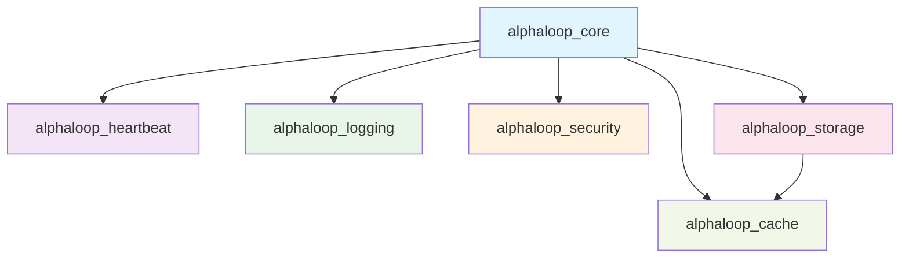

# AlphaLoop Infrastructure Modules

This directory contains **internal infrastructure modules** that provide essential services for the AlphaLoop system. These are **not separate packages** - they are internal Python modules used by `alphaloop_core`.

## 📦 Module Overview

| Module | Purpose | Key Features |
|---------|---------|--------------|
| **alphaloop_heartbeat** | Health monitoring | Service health checks, heartbeat generation, process monitoring |
| **alphaloop_logging** | Centralized logging | Multi-handler logging, Telegram integration, structured output |
| **alphaloop_security** | Security & encryption | Time-based authentication, data encryption, secure URLs |
| **alphaloop_storage** | Database management | Connection pooling, schema management, table operations |
| **alphaloop_cache** | Caching & messaging | Redis/Valkey integration, price caching, pub/sub |

## 🏗️ Architecture



### **Module Dependencies**
- **alphaloop_core** imports all infrastructure modules
- **alphaloop_storage** may use **alphaloop_cache** for caching
- **No circular dependencies** between modules
- **Internal modules** - not meant to be used outside alphaloop_core

## 🚀 Usage

### **Importing in alphaloop_core**

> Run examples from the repo root (e.g., `poetry run python ...`) so `infrastructure.*` resolves from `src/`.

```python
# Direct imports (these are internal modules)
from infrastructure.alphaloop_logging import AlphaLoopLogger, LoggingConfig
from infrastructure.alphaloop_storage import create_database_manager, TableHandler
from infrastructure.alphaloop_cache import CacheManager
from infrastructure.alphaloop_heartbeat import HeartbeatGenerator
from infrastructure.alphaloop_security import ConnectionAuthenticator
```

### **Using in Services**

```python
# Example: System Metrics Service
from alphaloop_logging import AlphaLoopLogger, LoggingConfig
from alphaloop_heartbeat import HeartbeatGenerator

class SystemMetricsService:
    def __init__(self):
        # Initialize infrastructure components
        logging_config = LoggingConfig.from_env(app_name="system-metrics")
        self.logger = AlphaLoopLogger(logging_config)
        self.heartbeat_generator = HeartbeatGenerator("system-metrics")
```

## 🔧 Configuration

### **Environment Variables**

Each module uses environment variables for configuration:

```bash
# alphaloop_heartbeat
HEARTBEAT_INTERVAL=30
HEARTBEAT_TIMEOUT=120
HEARTBEAT_DIRECTORY=/var/heartbeats

# alphaloop_logging
LOG_LEVEL=INFO
LOG_FORMAT=json
TELEGRAM_BOT_TOKEN=your_token
TELEGRAM_CHAT_ID=your_chat_id

# alphaloop_security
SECURITY_SECRET_KEY=your_secret_key
SECURITY_TIME_WINDOW=300

# alphaloop_storage
DB_HOST=localhost
DB_PORT=5432
DB_NAME=alphaloop
DB_USER=postgres
DB_PASSWORD=password

# alphaloop_cache
CACHE_HOST=localhost
CACHE_PORT=6379
CACHE_DB=0
CACHE_PASSWORD=
```

## 🧪 Testing

### **Testing Infrastructure Modules**

```bash
# Test all infrastructure modules
make test-infrastructure

# Test specific module
cd src/infrastructure/alphaloop_logging
python -m pytest tests/
```

### **Testing Integration with Core**

```bash
# Test infrastructure packages
make test-infrastructure

# Test Docker services
make services-test-e2e
```

## 📚 Module Documentation

- [alphaloop_heartbeat](./alphaloop_heartbeat/README.md) - Health monitoring
- [alphaloop_logging](./alphaloop_logging/README.md) - Logging system
- [alphaloop_security](./alphaloop_security/README.md) - Security utilities
- [alphaloop_storage](./alphaloop_storage/README.md) - Database management
- [alphaloop_cache](./alphaloop_cache/README.md) - Caching system

## 🎯 Key Points

- **These are internal modules**, not separate packages
- **No installation needed** - they're part of alphaloop_core
- **No versioning** - they evolve with alphaloop_core
- **No independent deployment** - they're used by Docker services
- **Simple imports** - direct Python module imports

---

**🎯 Goal**: These infrastructure modules provide a solid foundation for alphaloop_core services while maintaining clean separation of concerns and reusability within the project.
